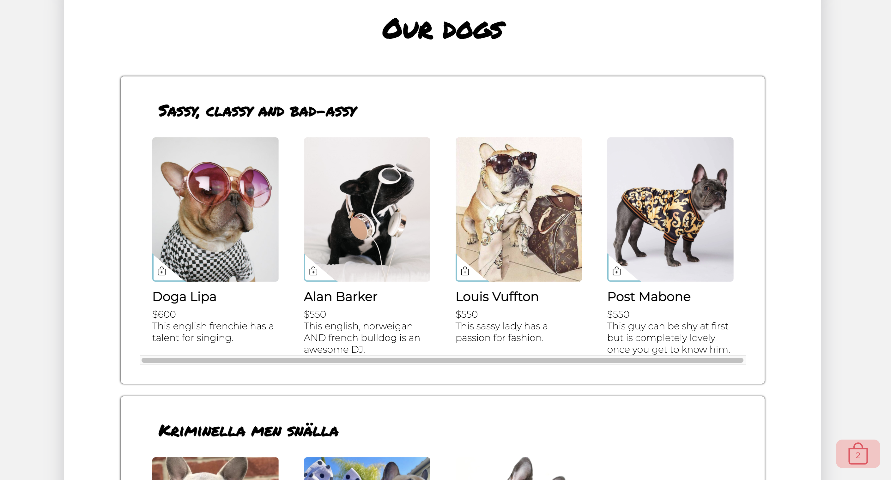

# Draw me like one of your french bulldogs webbshop.
Group assignment in JavaScript class at Medieinstitutet to create a webshop.

  

## Installation
1. Clone the repo\
`git clone https://github.com/julialotta/MI-JavaScript-Webshop`

2. Install npm packages\
`npm install`

3. Start parcel\
`npm run build`

Visit localhost:1234 to view the project

To test with cypress, run:
`npm run cyp`

## Built with
- HTML & SASS
- JavaScript
- TypeScript
- Parcel
- Cypress

## Contributors
[Julia-Lotta Tinglöf](https://github.com/julialotta)  
[Tuva-Li Wass Vallin](https://github.com/tuvaww)  
